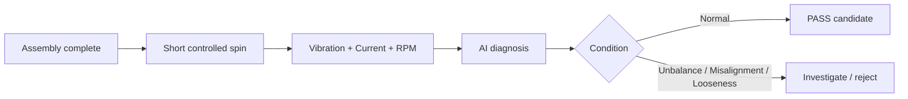
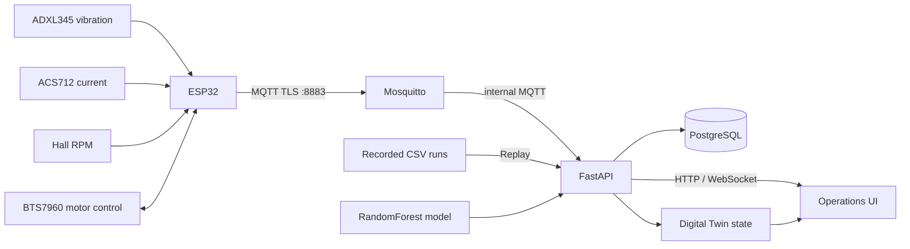

<p align="center">
  
</p>

# NEXis — AI End-of-Line Spin Inspection

<p align="center">
  <strong>Spin. Sense. Diagnose.</strong><br>
  Catch hidden assembly defects before shipment.
</p>

<p align="center">
  
</p>

A motor/shaft/coupling assembly can look correct after assembly and still contain a fault that only appears when it rotates. **NEXis runs a short controlled spin test, captures vibration + motor current + RPM together, and classifies the run as Normal, Unbalance, Misalignment, or Looseness.**

The goal is not another generic condition-monitoring dashboard. The goal is a concrete manufacturing gate: **use dynamic behavior to flag a suspicious assembly before shipment.**

| **225** | **217 / 225** | **96.44%** | **3 synchronized signals** |
|---:|---:|---:|---:|
| Physical recordings | Correct LOFO files | File-level accuracy | Vibration + Current + RPM |

**Quick judge links:** [Evidence](docs/EVIDENCE.md) · [3–5 min demo guide](docs/DEMO_GUIDE.md) · [Architecture](docs/ARCHITECTURE.md) · [Reproduce training](training/README.md)

## The inspection workflow



**Real hardware → real sensor data → AI diagnosis → inspection decision support.**

A complete physical cycle includes motor spin-up and stabilization. The classifier itself analyzes a **256-sample / 2.56-second** stable-data window at 100 Hz; NEXis does **not** claim that the entire inspection cycle always finishes in 2.56 seconds.

## Why this matters

Static exterior inspection can miss defects that change the dynamics of an assembled rotating system. Rotor unbalance, shaft/coupling misalignment, and loosened fastening can reveal themselves through vibration, load/current behavior, and rotational stability only after the assembly starts moving.

NEXis turns that short run into a repeatable inspection signal. Instead of showing raw telemetry alone, it connects the physical test to a condition diagnosis and a clear manufacturing decision path.

## What is proven today

| Capability | Status |
|---|---|
| ESP32 physical telemetry and motor-control node | **Implemented** |
| ADXL345 vibration sensing | **Implemented** |
| ACS712 motor-current sensing | **Implemented** |
| Hall-sensor RPM feedback | **Implemented** |
| MQTT transport | **Implemented** |
| FastAPI + WebSocket backend | **Implemented** |
| PostgreSQL telemetry/prediction history | **Implemented** |
| Browser operations workspace | **Implemented** |
| Recorded-run replay workspace | **Implemented** |
| Browser digital twin | **Implemented** |
| 4-class Normal / Unbalance / Misalignment / Looseness diagnosis | **Implemented** |

The strongest validated claim in this repository is the **sensor-based spin-inspection workflow above**. Roadmap ideas such as Vision setup verification, configurable inspection recipes, baseline anomaly detection for unseen assets, and generalized edge connectors are intentionally separated from implemented evidence.

## Physical prototype

<p align="center">
  
</p>

The current firmware uses these connections:

| Function | Pin |
|---|---:|
| Hall sensor / RPM pulse | GPIO 32 |
| ACS712 analog current | GPIO 36 |
| BTS7960 RPWM | GPIO 25 |
| BTS7960 LPWM | GPIO 26 |
| BTS7960 R_EN | GPIO 27 |
| BTS7960 L_EN | GPIO 14 |
| ADXL345 I²C SDA | GPIO 21 |
| ADXL345 I²C SCL | GPIO 22 |

### Physical fault setups

<p align="center">
  
</p>

The reference dataset contains physical runs representing:

- **Normal** — reference operating condition
- **Unbalance** — eccentric rotating mass
- **Misalignment** — shaft/coupling alignment fault
- **Looseness** — loosened fastening/mount condition

## Measured AI evidence

The repository ships with **225 physical CSV recordings** and the trained model used by the application.

| Class | Recordings | LOFO file-level recall |
|---|---:|---:|
| Normal | 72 | 95.83% |
| Unbalance | 10 | 100.00% |
| Misalignment | 63 | 92.06% |
| Looseness | 80 | 100.00% |
| **Total** | **225** | — |

### Evaluation method

The included training program uses **leave-one-file-out (LOFO)** validation. For each fold, one complete recording is held out and every window from that file stays out of training for that fold. This avoids the leakage risk of randomly mixing windows from the same recording into both train and test sets.

The model-selection run compared RandomForest and ExtraTrees. `RandomForest_fast` was selected and then retrained on all 225 recordings for the bundled inference artifact.

| Metric | Recorded result |
|---|---:|
| File-level accuracy | **96.44% (217/225)** |
| File-level macro-F1 | **97.05%** |
| Window-level accuracy | **96.21%** |
| Window-level macro-F1 | **96.85%** |
| Sampling frequency | **100 Hz** |
| Window size | **256 samples (2.56 s)** |
| Window step | **64 samples** |
| Engineered feature count | **383** |
| Final estimator | **RandomForest, 220 trees** |

<p align="center">
  
</p>

Raw evaluation outputs are committed under [`docs/evaluation/`](docs/evaluation/), including per-file predictions, per-window predictions, classification reports, feature importance, and model-selection results. The public training program is in [`training/reproduce_training.py`](training/reproduce_training.py).

> **Metric scope:** these results measure the supplied prototype dataset and operating setup. They are not evidence that the same classifier can identify the same faults on an arbitrary unseen machine without machine-specific validation.

## AI pipeline

<p align="center">
  
</p>

At runtime, NEXis waits for a valid rotating condition before feeding physical telemetry into the classifier. A 256-sample window is transformed into time-domain, spectral, vibration, control, current, and cross-signal features. The classifier produces class probabilities and the application stores/broadcasts the result.

The model details are intentionally below the product workflow: the differentiator is the **end-to-end physical inspection path**, not RandomForest by itself.

## End-to-end architecture



Two workspaces intentionally separate real hardware from demonstration data:

- **Physical** — consumes ESP32 telemetry and can issue controlled motor commands.
- **Demo** — replays bundled recordings and cannot use physical-control endpoints.

See [`docs/ARCHITECTURE.md`](docs/ARCHITECTURE.md) for the implementation map.

## The 60-second judge view

1. **Show the real rig first.** Make the physical motor/shaft assembly visible before opening dashboards.
2. **Start a controlled run.** Make it obvious that the telemetry comes from the moving hardware.
3. **Show vibration + current + RPM arriving together.**
4. **Show the condition result prominently.** Normal / Unbalance / Misalignment / Looseness should be easier to see than raw graphs.
5. **Show the evidence:** 225 physical recordings, 217/225 correct LOFO files, 96.44% file accuracy.
6. **Only then show architecture and expansion.**

For a 2–5 minute submission video, use [`docs/DEMO_GUIDE.md`](docs/DEMO_GUIDE.md).

> **Best visual upgrade before a final submission:** replace the static hero photo with a real 5–8 second GIF/video clip showing **rig starts → RPM rises → telemetry moves → diagnosis appears**. Do not use a synthetic or staged software-only animation as a substitute for the physical demo.

## From one validated station to a configurable inspection system

The current repository deliberately starts with one concrete, validated application rather than claiming universal diagnosis. The longer-term **FlexInspect** direction keeps this spin-test workflow as the reference asset while making the surrounding inspection system easier to reconfigure:

```text
CURRENT CORE
Rotating-drive spin test
  → synchronized vibration/current/RPM
  → validated four-class diagnosis
  → inspection result

NEXT LAYERS
Vision setup verification
  → verify sensor presence/placement before measurement

Configurable inspection recipes
  → bind machine component ↔ sensor stream ↔ visual region

Normal-baseline anomaly detection
  → provide a safe first step for assets without labeled fault data

Generalized edge connectors
  → expand beyond the current ESP32/MQTT reference node
```

These extensions should be added to the project page only when they are actually implemented and demonstrable in the submitted branch.

## Repository layout

```text
app/
  main.py                  FastAPI, MQTT, DB, replay, recording and control APIs
  ai_model.py              Runtime feature extraction and model inference
  model/                    Bundled trained model
  replay_data/              225 physical CSV recordings
  web/                      Operations UI and digital twin
firmware/
  NEXis_ESP32_AWS_Physical_v1_4_0/
training/
  reproduce_training.py     Public LOFO training/evaluation program
  README.md
docs/
  EVIDENCE.md               Claims, metrics and limitations
  ARCHITECTURE.md           Implementation map
  DEMO_GUIDE.md             2–5 minute generic demo storyboard
  HACKATHON_ADAPTATION.md   Track-specific adaptation without changing the core claim
  SUBMISSION_CHECKLIST.md   Reusable submission checklist
  HACKATHON_DISCLOSURE_TEMPLATE.md
  SUBMISSION_TEXT_TEMPLATE.md  Reusable project-page copy
  JUDGE_QA.md                  Grounded answers to common technical questions
  evaluation/               Raw evaluation reports
  images/                   Hardware, fault and model figures
scripts/
  public_repo_check.py      Secret/publication guard
  validate_evidence.py      Dataset/evaluation consistency check
.github/workflows/
  public-repo-check.yml
```

## Quick start

### 1. Configure server secrets

```bash
cp .env.example .env
```

Replace every `CHANGE_ME` value. `prepare.sh` rejects an empty or placeholder administrator/PostgreSQL password. Set `COOKIE_SECURE=true` when the browser reaches NEXis over HTTPS.

### 2. Create MQTT credentials and certificates

Create `mosquitto/passwd` locally and provide:

```text
mosquitto/certs/ca.crt
mosquitto/certs/server.crt
mosquitto/certs/server.key
```

These are intentionally excluded from Git.

### 3. Configure ESP32 secrets

Copy:

```text
firmware/NEXis_ESP32_AWS_Physical_v1_4_0/secrets.example.h
```

to `secrets.h`, then set the Wi-Fi setup AP password, MQTT username/password, broker host, and CA certificate for your deployment. `secrets.h` is ignored by Git.

### 4. Start the stack

```bash
./prepare.sh
```

The supplied Docker Compose stack starts FastAPI, PostgreSQL, Mosquitto, and Nginx.

## Reproduce or inspect the evidence

Run lightweight repository checks:

```bash
python scripts/public_repo_check.py
python scripts/validate_evidence.py
```

To reproduce the full model-selection/evaluation process:

```bash
python training/reproduce_training.py
```

Full LOFO training is CPU-intensive because it repeatedly fits ensemble models. The committed evaluation CSVs are provided so judges can inspect the reference results without waiting for a complete rerun.

## Security and safety notes

- No intended production passwords, private TLS keys, shell history, database dumps, or local-user paths are included.
- The ESP32 setup AP password is not printed to the serial console in this public version.
- The anonymous MQTT listener on port 1883 remains internal to the Compose network; the physical-device listener is TLS/authenticated on 8883.
- The included Nginx configuration listens on HTTP port 80. Use HTTPS termination for an Internet-facing deployment.
- NEXis is an engineering prototype, **not a certified machine-safety system**. Browser/MQTT control must not be the sole safety layer around hazardous machinery.
- Guest Demo sessions are separated from the Physical workspace and cannot use physical-control endpoints.

See [`SECURITY.md`](SECURITY.md).

## Reusing NEXis across hackathons

Keep this repository's core claim stable: **a real, evidence-backed end-of-line spin-inspection workflow**. For a sponsor or specialist track, add a genuine new module around that core rather than renaming an unrelated project.

Examples include a Physical-AI reasoning layer, an inspection agent, a vision setup validator, a DevSecOps automation layer, or a SaaS deployment layer. [`docs/HACKATHON_ADAPTATION.md`](docs/HACKATHON_ADAPTATION.md) explains how to do this without implying that roadmap features already exist.

If a competition asks teams to identify work completed during the event, use [`docs/HACKATHON_DISCLOSURE_TEMPLATE.md`](docs/HACKATHON_DISCLOSURE_TEMPLATE.md) to distinguish the base repository from event-built additions. Always follow the specific event rules.
