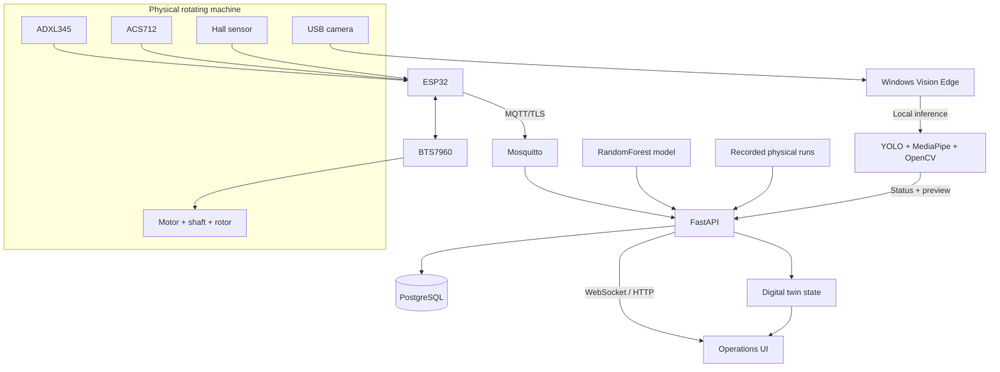

<p align="center">
  
</p>

# NEXis - AI End-of-Line Inspection for Rotating Assemblies

<p align="center">
  <strong>Spin. Sense. See. Diagnose.</strong><br>
  A connected end-of-line inspection platform for rotating assemblies using multi-sensor diagnosis, local machine vision, controlled spin testing, and a synchronized digital twin.
</p>

<p align="center">
  <a href="http://nexisai.duckdns.org"><strong>Live Demo</strong></a>
  &nbsp;·&nbsp;
  <a href="https://youtu.be/6Vdj4-uL7Y0"><strong>Demo Video</strong></a>
</p>

<p align="center">
  
</p>

NEXis is an engineering prototype for the final inspection step after assembly and before product release. It combines a controlled spin test with synchronized vibration, motor-current, and RPM measurements. A local Windows vision process verifies the inspection area and sensor setup, while the server provides diagnosis, recording, replay, control, history, and a synchronized digital twin through one browser interface.

## Inspection workflow

**Verify setup -> run a controlled spin test -> capture synchronized vibration/current/RPM -> diagnose the operating condition -> review visual and sensor evidence -> pass candidate or inspect/correct/retest.**

The application separates two workspaces:

- **Physical Station** — live ESP32 telemetry, motor control, AI diagnosis, Vision Safety, recording, event history, and a synchronized digital twin.
- **Recorded Demo** — repeatable replay of physical CSV recordings with the same diagnosis and visualization path, isolated from physical motor control.

## Physical inspection stack

| Layer | Implementation |
|---|---|
| Vibration | ADXL345, 3-axis, 100 Hz |
| Motor current | ACS712 |
| Rotational speed | Hall sensor RPM feedback |
| Motor drive | ESP32 + BTS7960 |
| Device transport | MQTT / TLS |
| Backend | FastAPI + WebSocket |
| Storage | PostgreSQL + runtime recordings |
| Diagnosis | RandomForest multi-class classifier |
| Vision | YOLO + MediaPipe + OpenCV |
| Visualization | Browser dashboard + synchronized WebGL digital twin |

## Vision Safety

Camera inference runs locally on the Windows PC connected to the camera. The server receives compact detection status and a low-rate preview frame for operator visibility.

Implemented checks include:

- **Person detection** with YOLO and danger/warning-zone evaluation.
- **Hand detection** with MediaPipe, with a motion/skin fallback when the optional hand detector is unavailable.
- **Generic moving-object intrusion detection** inside configured warning and danger regions.
- **User-defined hazard polygon** and warning margin.
- **Hall sensor LED blink detection** using repeated brightness transitions inside a configured ROI.
- **Rotor motion detection** using visual motion evidence inside a configured ROI.
- **Sensor mount verification** for ADXL345, ACS712, and Hall sensor locations using a captured visual baseline.
- **Camera selection, camera-off control, and manual camera refresh** from the browser.
- **Linked/mobile and virtual camera filtering** before a Windows camera stream is opened.
- **Persistent setup and baseline state** synchronized between the server and the edge process.

The preview overlays person, hand, and generic motion boxes with zone state and confidence/evidence values. Vision detections are supervisory inspection signals and are not safety-rated protective functions.

## Condition diagnosis

NEXis classifies four conditions:

- **Normal**
- **Unbalance**
- **Misalignment**
- **Fastener Looseness**

The repository includes the physical recordings, training code, model artifact, and evaluation outputs used by the application.

| Metric | Recorded result |
|---|---:|
| Physical recordings | **225** |
| Correct LOFO files | **217 / 225** |
| File-level accuracy | **96.44%** |
| File-level macro-F1 | **97.05%** |
| Window-level accuracy | **96.21%** |
| Window-level macro-F1 | **96.85%** |
| Sampling frequency | **100 Hz** |
| Window size | **256 samples / 2.56 s** |
| Window step | **64 samples** |
| Engineered features | **383** |
| Classifier | **RandomForest, 220 trees** |

| Condition | Recordings | LOFO file-level recall |
|---|---:|---:|
| Normal | 72 | 95.83% |
| Unbalance | 10 | 100.00% |
| Misalignment | 63 | 92.06% |
| Fastener Looseness | 80 | 100.00% |

<p align="center">
  
</p>

The evaluation uses **leave-one-file-out (LOFO)** validation so windows from the held-out recording never enter the training set for that fold. These metrics are scoped to the supplied rig, acquisition procedure, and dataset.

## Architecture



See [Architecture](docs/ARCHITECTURE.md), [Evidence](docs/EVIDENCE.md), and [Validation](docs/VALIDATION.md) for implementation and claim boundaries.

## Recorded Demo

The Recorded Demo is isolated from physical motor-control endpoints. Selecting a condition starts continuous playback of matching physical CSV recordings until **Stop** is pressed. The browser uses the same diagnosis and visualization pipeline while the digital twin follows replay RPM and condition state.

The Vision Safety Demo uses a fixed digital-twin viewpoint so hazard and sensor regions stay spatially stable while the machine remains animated from replay data.

## Repository layout

```text
app/
  main.py                   FastAPI, MQTT, WebSocket, replay, vision, recording and control APIs
  ai_model.py               Runtime feature extraction and model inference
  model/                     Trained classifier artifact
  replay_data/               Physical CSV recordings used by Recorded Demo
  web/                       Operations UI and WebGL digital twin
edge_vision/
  vision_edge_agent.py       Local camera inference and server synchronization
  yolo11n.pt                 Person detector weights
  START_NEXIS_VISION.vbs     One-click Windows launcher
firmware/
  NEXis_ESP32_Physical/      ESP32 motor/sensor/MQTT firmware
training/
  reproduce_training.py      Training and LOFO evaluation
scripts/
  validate_repo.py           Repository cleanliness and source checks
  validate_evidence.py       Dataset/evaluation consistency validation
docs/
  ARCHITECTURE.md
  EVIDENCE.md
  TECHNICAL_QA.md
  VALIDATION.md
  evaluation/
  images/
```

## Server quick start

### 1. Configure environment values

```bash
cp .env.example .env
```

Set a strong PostgreSQL password and a random `VISION_EDGE_TOKEN` before deployment.

### 2. Provide MQTT credentials and certificates

Create `mosquitto/passwd` and provide:

```text
mosquitto/certs/ca.crt
mosquitto/certs/server.crt
mosquitto/certs/server.key
```

These files are intentionally excluded from Git.

### 3. Start the stack

```bash
./prepare.sh
```

The Compose stack starts FastAPI, PostgreSQL, Mosquitto, and Nginx.

## ESP32 setup

Copy `firmware/NEXis_ESP32_Physical/secrets.example.h` to `secrets.h`, then configure Wi-Fi, MQTT credentials, broker address, and the CA certificate. `secrets.h` is excluded from Git.

## Windows vision connector

1. Copy `edge_vision/server_url.example.txt` to `edge_vision/server_url.txt`.
2. Set the NEXis server URL.
3. Run `edge_vision/START_NEXIS_VISION.vbs`.
4. Open **Physical Station -> Vision Safety**.
5. Select the intended camera. Use **Refresh Cameras** only after camera hardware changes.

The launcher reuses the local Vision environment when available. Runtime state, logs, and sensor baselines are stored under `%LOCALAPPDATA%\NEXis\VisionEdge` rather than in the repository.

## Validation

```bash
python scripts/validate_repo.py
python scripts/validate_evidence.py
python -m py_compile app/main.py app/ai_model.py edge_vision/vision_edge_agent.py
node --check app/web/assets/app.js
node --check app/web/assets/digital_twin.js
```

CI runs repository, evidence, Python, JavaScript, and shell checks on pushes and pull requests.

## Safety and deployment boundary

NEXis is an engineering prototype and **not a safety-rated PLC, emergency-stop system, interlock, machine guard, or certified quality station**. Physical safety mechanisms must remain independent of browser, camera, MQTT, cloud, and ESP32 software.

The browser UI uses direct workspace selection instead of a user-login form. Internet-facing deployments should place NEXis behind an appropriate access-control layer or restrict network access to trusted users.

See [SECURITY.md](SECURITY.md) for deployment notes.
