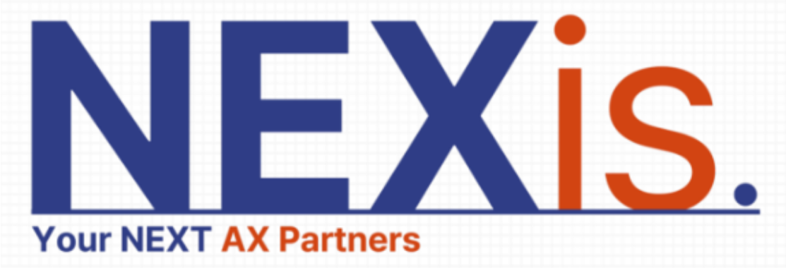
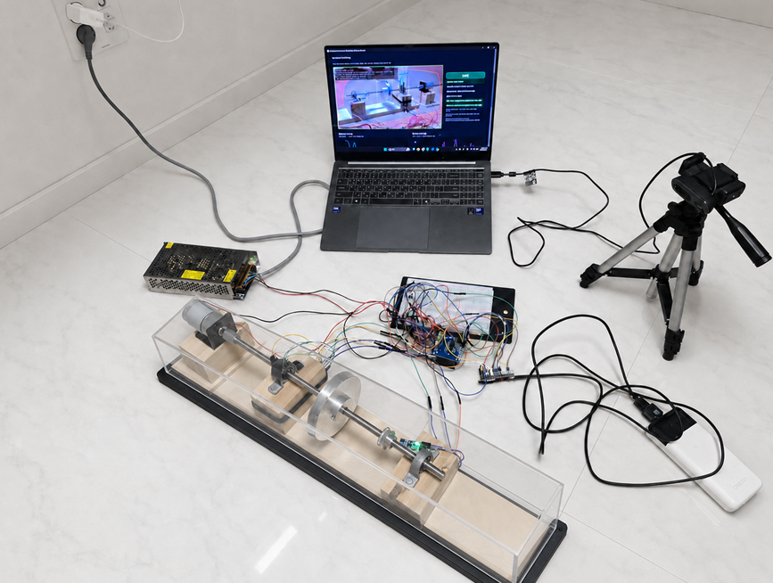
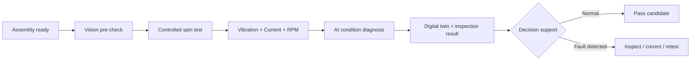
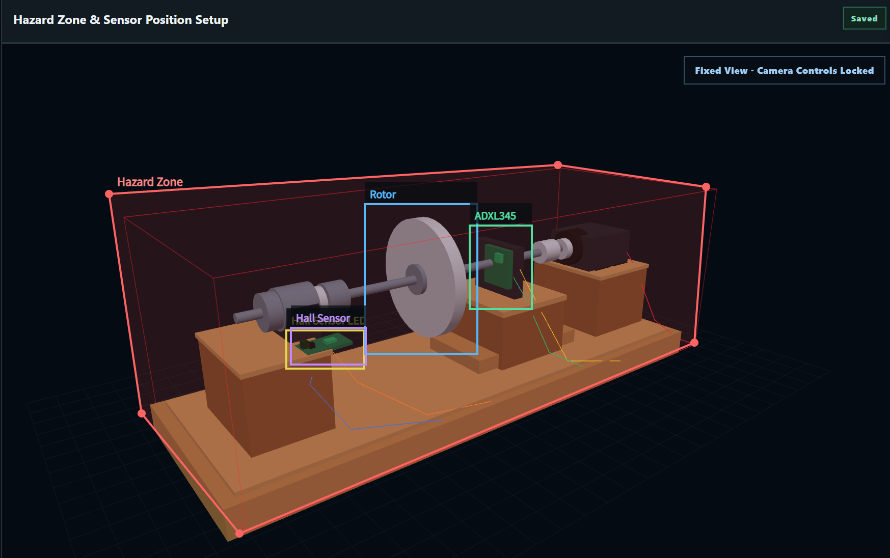
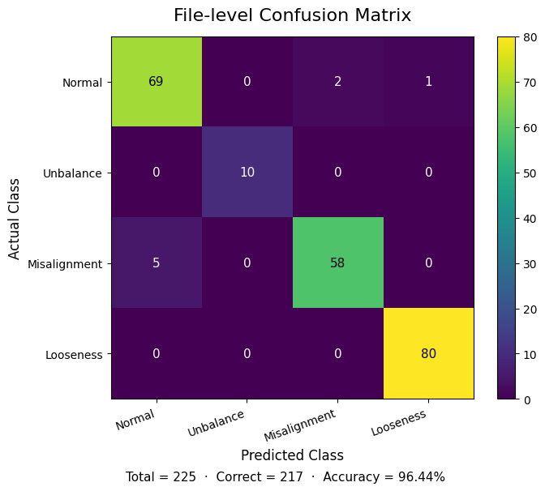
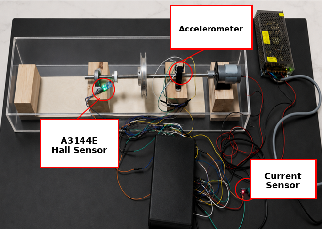
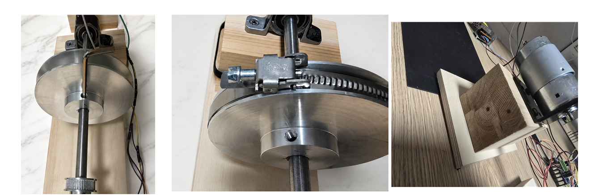
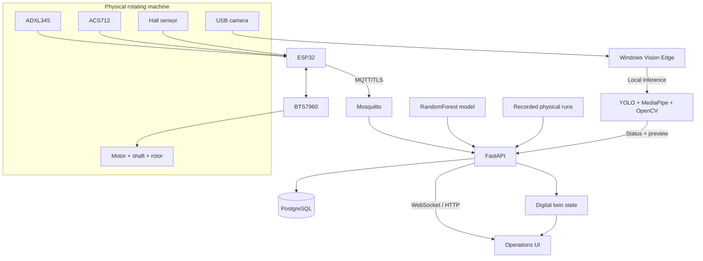

<p align="center">
  
</p>

# NEXis — AI Machine Commissioning & Inspection

<p align="center">
  <strong>Spin. Sense. See. Diagnose.</strong><br>
  A connected inspection platform for rotating machinery that combines multi-sensor diagnosis, vision safety checks, controlled spin testing, and a synchronized digital twin.
</p>

<p align="center">
  
</p>

NEXis is an end-of-line inspection prototype for rotating assemblies. A controlled spin test brings hidden dynamic faults to the surface while vibration, motor current, and RPM are captured together. The platform classifies the operating condition, visualizes the machine state, records evidence, and adds an edge-vision pre-check for personnel, sensor placement, Hall-sensor LED activity, and rotor motion.

## Why NEXis

Most machine-monitoring prototypes stop at one layer: a sensor classifier, a camera detector, or a dashboard. NEXis connects the full inspection loop:

**Verify setup -> run a controlled spin test -> capture synchronized vibration/current/RPM -> diagnose the condition -> visualize and record the evidence -> correct and retest.**

The core distinction is integration. Sensor diagnosis, visual setup verification, controlled actuation, evidence logging, replay, and the synchronized digital twin are part of one inspection workflow rather than separate demonstrations. Physical, replay, and vision claims remain explicitly separated where their evidence differs.

## Proof at a glance

| Evidence | Current repository |
|---|---:|
| Physical recordings | **225** |
| LOFO file-level accuracy | **96.44%** |
| LOFO file-level macro-F1 | **97.05%** |
| Diagnosed conditions | **4** |
| Physical signals | **Vibration + current + RPM** |
| Edge vision | **Person + hand zones + Hall LED + rotor motion + sensor-mount baseline** |
| Reproducibility | **Training code + raw evaluation outputs + CI checks** |

For the exact metric scope and raw evaluation artifacts, see [Evidence](docs/EVIDENCE.md) and [Validation](docs/VALIDATION.md).

## Inspection loop



The platform provides two clearly separated workspaces:

- **Physical Station** — live ESP32 telemetry, controlled motor commands, AI diagnosis, vision safety, recording, event history, and a synchronized digital twin.
- **Recorded Demo** — repeatable replay of physical CSV recordings with continuous condition playback, AI diagnosis, animated fault behavior, and a fixed-view digital-twin vision setup.

## Physical inspection stack

| Layer | Implementation |
|---|---|
| Vibration | ADXL345, 3-axis, 100 Hz |
| Motor current | ACS712 |
| Rotational speed | Hall sensor RPM feedback |
| Motor drive | ESP32 + BTS7960 |
| Edge transport | MQTT / TLS |
| Backend | FastAPI + WebSocket |
| Storage | PostgreSQL + runtime recordings |
| Diagnosis | RandomForest multi-class classifier |
| Vision | YOLO person detection + MediaPipe hand tracking + OpenCV ROI analysis |
| Visualization | Browser dashboard + synchronized WebGL digital twin |

## Vision safety and setup verification

The Physical Station can run a Windows edge-vision connector next to the machine. Camera inference runs locally; compact status data and a low-rate preview frame are synchronized to the server.

Implemented checks include:

- **Person detection** with YOLO.
- **Hand detection** with MediaPipe and danger/warning-zone intersection checks.
- **User-defined hazard polygon** and configurable warning margin.
- **Hall sensor LED blink detection** based on repeated brightness transitions inside a configured ROI. A continuously illuminated LED is not treated as a valid blink sequence.
- **Rotor motion detection** using local visual motion evidence inside a configured ROI.
- **Sensor mount verification** for ADXL345, ACS712, and Hall sensor positions using a captured visual baseline and multi-frame change confirmation.
- **Persistent setup** with saved hazard/ROI geometry, reset, and baseline recapture workflows.

> Sensor mount verification is a visual baseline-change check, not generic sensor-object recognition. Camera position and lighting should remain stable after calibration.

<p align="center">
  
</p>

The Recorded Demo exposes the same setup concept on a **fixed digital-twin viewpoint**. Camera orbit, pan, and zoom are locked while the machine itself remains animated: the rotor spins with replay RPM, the Hall LED pulses, and fault-specific motion is shown for unbalance, misalignment, and fastener looseness.

## Condition diagnosis

NEXis classifies four conditions:

- **Normal**
- **Unbalance**
- **Misalignment**
- **Fastener Looseness**

The repository includes the physical recordings, training code, model artifact, and evaluation outputs used by the application.

| Metric | Recorded result |
|---|---:|
| Physical recordings | **225** |
| Correct LOFO files | **217 / 225** |
| File-level accuracy | **96.44%** |
| File-level macro-F1 | **97.05%** |
| Window-level accuracy | **96.21%** |
| Window-level macro-F1 | **96.85%** |
| Sampling frequency | **100 Hz** |
| Window size | **256 samples / 2.56 s** |
| Window step | **64 samples** |
| Engineered features | **383** |
| Classifier | **RandomForest, 220 trees** |

| Condition | Recordings | LOFO file-level recall |
|---|---:|---:|
| Normal | 72 | 95.83% |
| Unbalance | 10 | 100.00% |
| Misalignment | 63 | 92.06% |
| Fastener Looseness | 80 | 100.00% |

<p align="center">
  
</p>

The evaluation uses **leave-one-file-out (LOFO)** validation so windows from the held-out recording never enter the training set for that fold. These metrics describe the supplied physical test rig and dataset; they are not a claim of universal transfer to arbitrary unseen machines.

## Physical evidence

The repository includes the real sensor layout and representative fault setups used for the rotating-machine recordings.

<p align="center">
  
  
</p>

The images above document the physical test configuration; the measured model results remain scoped to this rig and acquisition procedure.

## System architecture



See [Architecture](docs/ARCHITECTURE.md) for the implementation map and [Evidence](docs/EVIDENCE.md) for claim boundaries.

## Recorded Demo

The demo workspace is intentionally isolated from physical motor control. Selecting a condition starts continuous playback:

1. one matching physical CSV is selected;
2. its samples replay through the same presentation and diagnosis path;
3. when it finishes, another matching file is selected;
4. playback continues until **Stop** is pressed.

The digital twin follows replay RPM and condition state. This allows Normal, Unbalance, Misalignment, and Fastener Looseness to be demonstrated repeatedly without commanding the real motor.

## Repository layout

```text
app/
  main.py                   FastAPI, MQTT, WebSocket, replay, vision, recording and control APIs
  ai_model.py               Runtime feature extraction and model inference
  model/                     Trained classifier artifact
  replay_data/               Physical CSV recordings used by Recorded Demo
  web/                       Operations UI and WebGL digital twin
edge_vision/
  vision_edge_agent.py       Local camera inference and server synchronization
  yolo11n.pt                 Person detector weights
  START_NEXIS_VISION.vbs     One-click Windows launcher
firmware/
  NEXis_ESP32_Physical/      ESP32 motor/sensor/MQTT firmware
training/
  reproduce_training.py      Training and LOFO evaluation
scripts/
  validate_repo.py           Repository cleanliness and source checks
  validate_evidence.py       Dataset/evaluation consistency validation
docs/
  ARCHITECTURE.md
  DEMO_GUIDE.md
  EVIDENCE.md
  TECHNICAL_QA.md
  VALIDATION.md
  evaluation/
  images/
```

## Server quick start

### 1. Configure environment values

```bash
cp .env.example .env
```

Set a strong PostgreSQL password and a random `VISION_EDGE_TOKEN` before deployment.

### 2. Provide MQTT credentials and certificates

Create `mosquitto/passwd` and provide:

```text
mosquitto/certs/ca.crt
mosquitto/certs/server.crt
mosquitto/certs/server.key
```

These files are intentionally excluded from Git.

### 3. Start the stack

```bash
./prepare.sh
```

The Compose stack starts FastAPI, PostgreSQL, Mosquitto, and Nginx.

## ESP32 setup

Copy:

```text
firmware/NEXis_ESP32_Physical/secrets.example.h
```

to `secrets.h`, then configure the Wi-Fi setup AP password, MQTT credentials, broker address, and CA certificate. `secrets.h` is excluded from Git.

## Windows vision connector

Open `edge_vision/README.md`, create `server_url.txt` from `server_url.example.txt`, and run:

```text
START_NEXIS_VISION.vbs
```

The launcher creates/reuses a local Python environment, connects to the Physical Station workspace, retrieves the edge token, starts the camera service, and opens Vision Safety in the browser. Camera selection and camera-off controls are available from the web UI.

## Validation

```bash
python scripts/validate_repo.py
python scripts/validate_evidence.py
python -m py_compile app/main.py app/ai_model.py edge_vision/vision_edge_agent.py
node --check app/web/assets/app.js
node --check app/web/assets/digital_twin.js
```

CI runs the repository, evidence, Python, JavaScript, and shell checks on every push and pull request.

## Safety and deployment boundary

NEXis is an engineering prototype and **not a safety-rated PLC, emergency-stop system, interlock, machine guard, or certified quality station**. Physical safety mechanisms must remain independent of browser, camera, MQTT, cloud, and ESP32 software.

The browser UI intentionally uses direct workspace selection instead of a user-login form. For Internet-facing deployments, place NEXis behind an appropriate access-control layer or restrict network access to trusted users.

See [SECURITY.md](SECURITY.md) for deployment notes.
