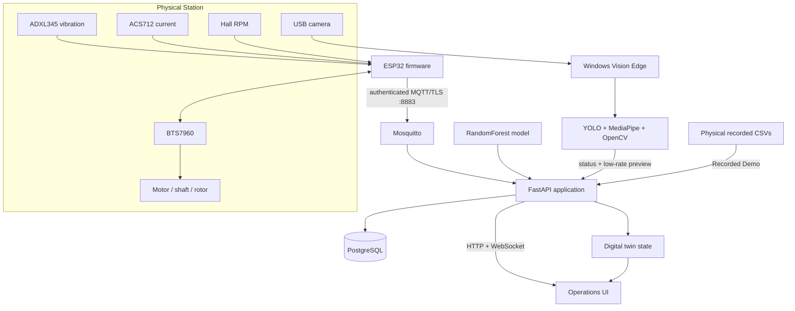

# Architecture

## Overview

NEXis separates the physical inspection path, Windows edge-vision path, and recorded replay path while presenting them through one operations interface.

## Physical Station

The ESP32 streams vibration, current, RPM, and control state through MQTT. The backend accepts physical telemetry at idle so operators can observe the station before a spin test begins.

AI inference has a separate operating-condition gate. Samples enter the diagnosis window only after a target RPM is set and actual speed reaches the configured minimum ratio. Motor commands use target-RPM bounds, an arming interval, command TTL, and device-online checks before publication.

## Windows Vision Edge

Camera inference runs on the Windows machine connected to the camera. The edge process performs:

- YOLO person detection;
- MediaPipe hand detection with a motion/skin fallback when needed;
- generic moving-object intrusion detection;
- hazard and warning-zone evaluation;
- Hall LED blink analysis;
- rotor visual-motion analysis;
- ADXL345, ACS712, and Hall-sensor mount baseline comparison;
- camera enumeration, selection, camera-off handling, and explicit refresh.

On Windows, camera friendly names are enumerated before opening a stream. Linked/mobile and virtual camera names are filtered so the connector does not probe them as ordinary webcams. Camera enumeration occurs at startup and again only after the browser sends an explicit refresh request.

The cloud receives compact status data and a low-rate preview JPEG. Person, hand, and motion detections include box coordinates and zone/evidence values so the browser can render synchronized overlays.

Vision setup is stored in the server runtime volume. The user can persist a hazard polygon, warning margin, Hall LED ROI, rotor ROI, and sensor-mount ROIs. Sensor baselines are captured on the edge and associated with the active server configuration revision.

## Recorded Demo

Recorded Demo uses the physical CSV recordings bundled with the repository and is isolated from physical motor-control endpoints. After a condition is selected, matching files replay continuously until Stop is requested.

The demo digital twin follows replay RPM and condition state. The fixed-view Vision Safety Demo keeps camera orbit, zoom, and pan locked while machine animation remains active.

## Diagnosis path

`app/ai_model.py` reproduces the feature pipeline expected by the bundled classifier. A 256-sample window at 100 Hz is transformed into the model feature vector. Class probabilities are stored in PostgreSQL, broadcast to the browser, and mapped to the digital-twin state.

The training and evaluation pipeline is implemented in `training/reproduce_training.py`.

## Storage

PostgreSQL stores telemetry, predictions, class probabilities, and recording metadata. Raw recordings created at runtime are stored under the mounted `runtime/` volume and excluded from Git.

Vision runtime state is stored under `runtime/vision/`. Local Windows Vision state, logs, and sensor baselines are stored under `%LOCALAPPDATA%\NEXis\VisionEdge`.

## Network boundary

The default stack exposes HTTP through Nginx on port 80 and authenticated MQTT/TLS for the physical device on port 8883. The anonymous MQTT listener remains inside the Compose network.

## Safety boundary

NEXis is supervisory inspection software. It is not a safety-rated controller. Emergency stops, guards, interlocks, current protection, and other safety mechanisms must remain independent of the browser, cloud, vision process, and ESP32 application logic.
