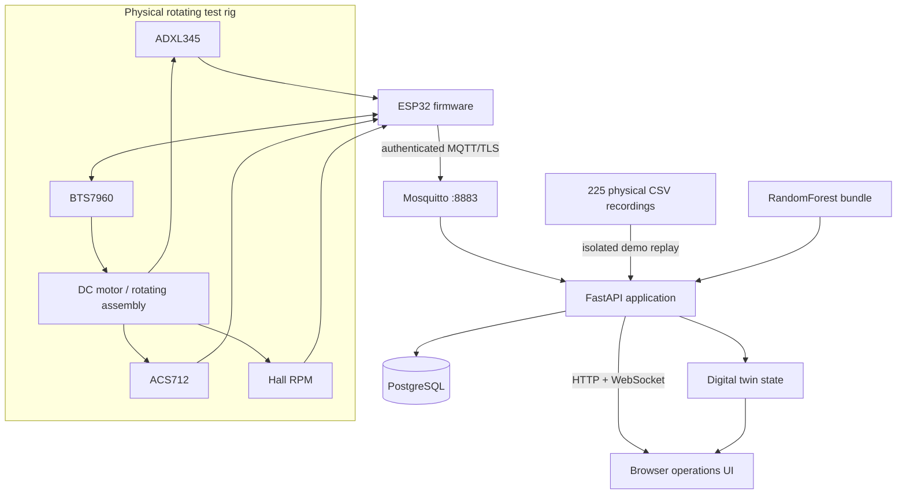

# Architecture

## Core data/control path

## Physical workspace

The physical path ingests telemetry from the ESP32 even while RPM is zero so operators can observe and record state. Model inference has an additional eligibility gate: the target RPM must be set and actual RPM must reach the configured minimum ratio before physical samples are admitted to the diagnosis window.

Motor actions are explicit API operations. The server publishes command messages over MQTT and applies configured RPM bounds, an arming window, command TTL, and edge-online checks.

## Demo workspace

The Demo workspace replays bundled CSV recordings through the same telemetry/inference presentation path but cannot invoke physical motor-control endpoints. This keeps reproducible software demonstration separate from real equipment control.

## Model path

`app/ai_model.py` implements the inference-side feature extraction expected by the bundled model. The training/evaluation implementation is in `training/reproduce_training.py`.

## Storage

PostgreSQL stores:

- telemetry
- predictions and class probabilities
- recording metadata

Raw recording files generated at runtime are stored outside the source tree under the mounted runtime volume and are ignored by Git.

## Security boundary

The default Compose configuration keeps anonymous MQTT port 1883 inside the Docker network. The externally published physical listener uses port 8883 and expects credentials plus TLS materials that are intentionally not committed.

Repository guardrails reject common secret/private-key patterns, user-home paths, database files, archives, and oversized GitHub files before changes are published.

## Industrial-safety boundary

NEXis is a software/hardware prototype. It is not a safety-rated PLC, interlock, emergency-stop circuit, machine-guard controller, or certified quality station. Hardware safety measures must remain independent of browser and network software.
