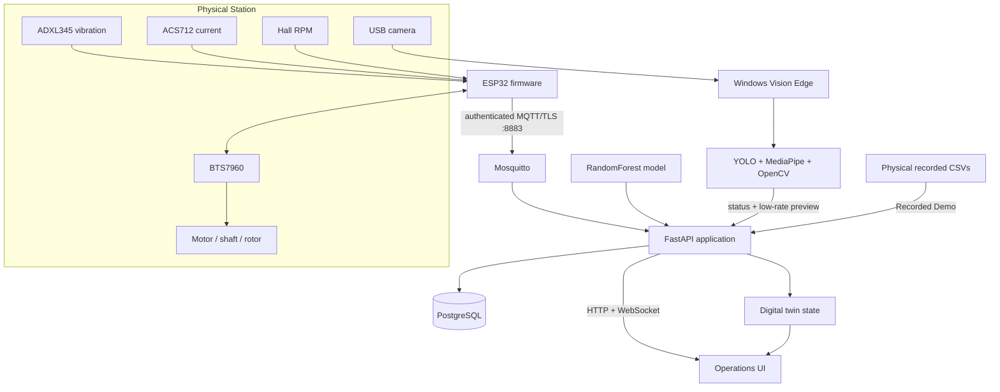

# Architecture

## Overview

NEXis separates the **physical inspection path**, **edge-vision path**, and **recorded demonstration path** while presenting them through one operations interface.

## Physical Station

The ESP32 streams vibration, current, RPM, and control state to the cloud through MQTT. The backend accepts physical telemetry even at zero RPM so operators can observe idle behavior and record state.

AI inference has a separate operating-condition gate. Physical samples enter the diagnosis window only after a target RPM has been set and the actual speed reaches the configured minimum ratio. This prevents startup transients from being treated as a stable inspection window.

Motor commands are explicit server operations. The backend applies target-RPM bounds, an arming interval, command TTL, and edge-online checks before publishing commands to the ESP32.

## Vision edge

Camera inference is intentionally performed on the Windows machine connected to the camera.

The edge process performs:

- YOLO person detection;
- MediaPipe hand detection;
- hazard/warning-zone intersection checks;
- Hall LED repeated brightness-transition detection;
- rotor visual-motion detection;
- sensor-mount baseline comparison;
- camera discovery and switching.

The cloud receives compact status data and a low-rate preview JPEG. The preview is for operator visibility; AI decisions are produced from the local camera frames before upload.

Vision setup is stored in the server runtime volume. The user can configure and persist a hazard polygon, warning margin, Hall LED ROI, rotor ROI, and sensor-mount ROIs. Sensor baselines are captured on the edge and bound to the current server configuration revision.

## Recorded Demo

The Recorded Demo uses the physical CSV recordings bundled with the repository but is isolated from physical motor-control endpoints.

After a condition is selected, the backend continuously chooses a matching recording and replays it. At the end of a file, another recording from the same condition is selected and playback continues until Stop is requested.

The demo digital twin uses replay RPM and condition state. The fixed-view Vision Safety Demo reuses the same machine geometry as an inspection frame while locking camera orbit, zoom, and pan. The machine itself remains animated:

- rotor rotation follows replay RPM;
- the Hall LED pulses while the rotor is turning;
- unbalance adds eccentric/wobble behavior;
- misalignment adds coupling/shaft offset behavior;
- fastener looseness adds support/joint vibration behavior.

## Diagnosis path

`app/ai_model.py` implements inference-side feature extraction for the bundled classifier. A 256-sample window at 100 Hz is transformed into the feature vector expected by the model. Class probabilities are written to PostgreSQL, broadcast to the browser, and mapped to the digital-twin state.

The training and evaluation pipeline is implemented in `training/reproduce_training.py`.

## Storage

PostgreSQL stores telemetry, predictions, class probabilities, and recording metadata. Raw recordings created at runtime are stored under the mounted `runtime/` volume and are excluded from Git.

Vision runtime state is stored under `runtime/vision/`, including configuration, edge status, preview frame, camera selection, and generated edge-token state when applicable.

## Network boundary

The default stack exposes:

- HTTP through Nginx on port 80;
- authenticated MQTT/TLS for the physical device on port 8883.

The anonymous MQTT listener remains inside the Compose network.

## Safety boundary

NEXis is supervisory inspection software. It is not a safety-rated controller. Emergency stops, guards, interlocks, current protection, and other safety mechanisms must remain independent of the browser, cloud, vision process, and ESP32 application logic.
